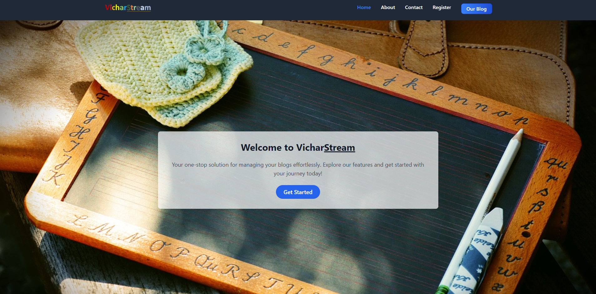
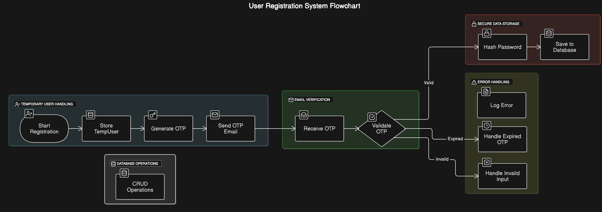
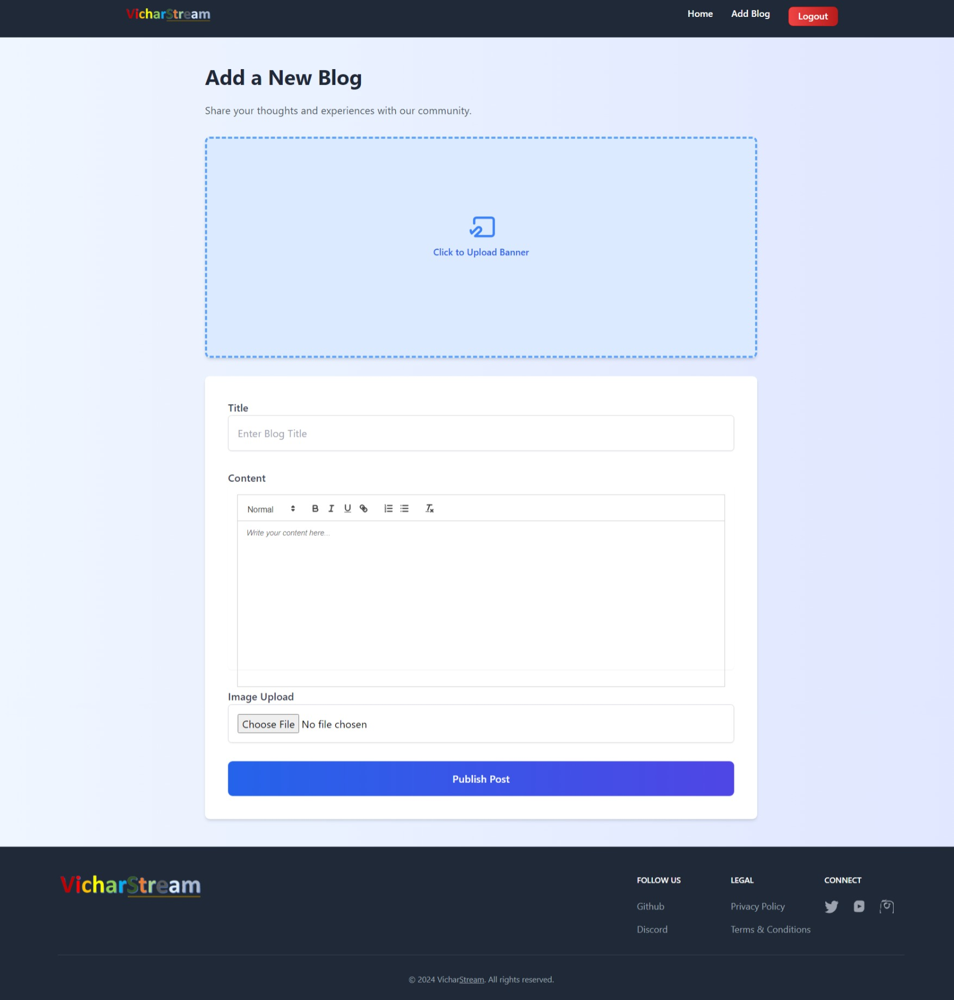

# VicharStream

<p align="center">
  
  
  
  
</p>

## Overview

VicharStream is a web application that provides user registration, OTP verification, and other functionalities. It is built using Spring Boot for the backend and React for the frontend, with Tailwind CSS for styling.

<p align="center">
  
</p>


## Features

- User Registration and Login
- OTP Verification for Password Recovery
- Protected Routes for Authenticated Users
- User Management
- Email Notifications


## Backend

The backend is built using Spring Boot and provides RESTful APIs for user management, OTP verification, and email notifications.

### 3-Layer Security System

This project implements a **3-layer security system** to ensure secure and validated user registration and authentication. It leverages temporary data storage, OTP verification, and secure data handling mechanisms for robust protection.

<p align="center">
  
</p>

---

### Layer 1: Temporary Data Storage and Validation

#### Temporary User Storage
- User data is temporarily stored in a `ConcurrentHashMap` as `TempUser`.
- Prevents database pollution by keeping unverified users out of the main database.

#### Basic Validations
- Checks for duplicate emails and usernames.
- Ensures all fields are valid and non-empty.

---

### Layer 2: OTP Verification

#### One-Time Password (OTP)
- A **randomly generated OTP** is sent to the user's email.
- The OTP is **valid for 2 minutes**.
- Ensures the provided email belongs to the user.

#### Temporary Session Management
- Unverified user data is stored temporarily in a `ConcurrentHashMap`.
- No interaction with the database occurs until OTP verification succeeds.

---

### Layer 3: Secure Data Handling and Authentication

#### Password Security
- Passwords are hashed using **bcrypt** before storage.
- Protects against password leaks, even in case of database compromise.

#### Email Verification Status
- The `isEmailVerified` flag ensures only verified users can access their accounts.
- Guards sensitive operations against unverified accounts.

#### Database Storage
- Upon successful OTP verification:
  - Validated user data is securely saved in the database.
  - Hashed passwords and necessary flags are stored.

---

### Features

1. **Temporary Storage for Validation**:  
   Users are temporarily stored in memory until verification, saving database resources.
   
2. **OTP-Based Verification**:  
   A two-minute, time-sensitive OTP ensures identity validation.

3. **Secure Password Management**:  
   Passwords are hashed using bcrypt for maximum security.

4. **Verified Access Only**:  
   Prevents unverified users from accessing system resources.

---

### How It Works

1. **User Registration**:  
   - User provides email, username, and password.
   - Data is stored temporarily in `ConcurrentHashMap`.

2. **Send OTP**:  
   - An OTP is sent to the user’s email.
   - The user enters the OTP to verify their email.

3. **Verification**:  
   - If the OTP is correct and within the time limit, the user is moved to the main database.
   - Passwords are hashed before storage.

4. **Post-Verification**:  
   - Verified users can log in and access the application.

---

### Potential Enhancements

- **Add CAPTCHA**: Prevent automated registrations.
- **Multi-Factor Authentication (MFA)**: Add an additional security layer during login.
- **Rate Limiting**: Prevent brute-force OTP attempts.
- **Email Verification Links**: Provide an alternative to OTP verification.


This 3-layer security system ensures a robust, reliable, and scalable user authentication workflow.

---


### Key Files and Directories

- [`server/src/main/java/com/application/server/controller/ForgotPasswordController.java`](server/src/main/java/com/application/server/controller/ForgotPasswordController.java): Handles password recovery requests.
- [`server/src/main/java/com/application/server/controller/UserController.java`](server/src/main/java/com/application/server/controller/UserController.java): Manages user registration, verification, and login.
- [`server/src/main/java/com/application/server/service/Impl/UserServiceImpl.java`](server/src/main/java/com/application/server/service/Impl/UserServiceImpl.java): Implements user-related services.
- [`server/src/main/java/com/application/server/service/Impl/EmailService.java`](server/src/main/java/com/application/server/service/Impl/EmailService.java): Sends email notifications.
- [`server/src/test/java/com/application/server/service/EmailServiceTest.java`](server/src/test/java/com/application/server/service/EmailServiceTest.java): Unit tests for the email service.

### User Registration and OTP Verification
<p align="center">
  
</p>


## Frontend

The frontend is built using React and styled with Tailwind CSS. It provides a user-friendly interface for registration, login, and other functionalities.

### Key Files and Directories

- [`client/src/App.js`](client/src/App.js): Main application component that sets up routing.
- [`client/src/components/ForgotPassword.js`](client/src/components/ForgotPassword.js): Component for password recovery.
- [`client/src/components/Footer.js`](client/src/components/Footer.js): Footer component.
- [`client/src/pages/Home.js`](client/src/pages/Home.js): Home page component.
- [`client/src/index.css`](client/src/index.css): Tailwind CSS configuration.

## Getting Started

### Blog Add Page
<p align="center">
  
</p>


### Prerequisites

- Node.js
- npm
- Java
- Maven

### Installation

1. Clone the repository:

```sh
git clone https://github.com/your-repo/vicharstream.git
cd vicharstream
```

2. Install frontend dependencies:

```sh
cd client
npm install
```

3. Install backend dependencies:

```sh
cd ../server
./mvnw install
```

### Running the Application

1. Start the backend server:

```sh
cd server
./mvnw spring-boot:run
```

2. Start the frontend development server:

```sh
cd client
npm start
```

### Running Tests

#### Backend Tests
To run backend tests, use the following command:
```sh
cd server
./mvnw clean package
```

#### Frontend Tests
To build the frontend for production, use the following command:
```sh
cd client
npm run build
```